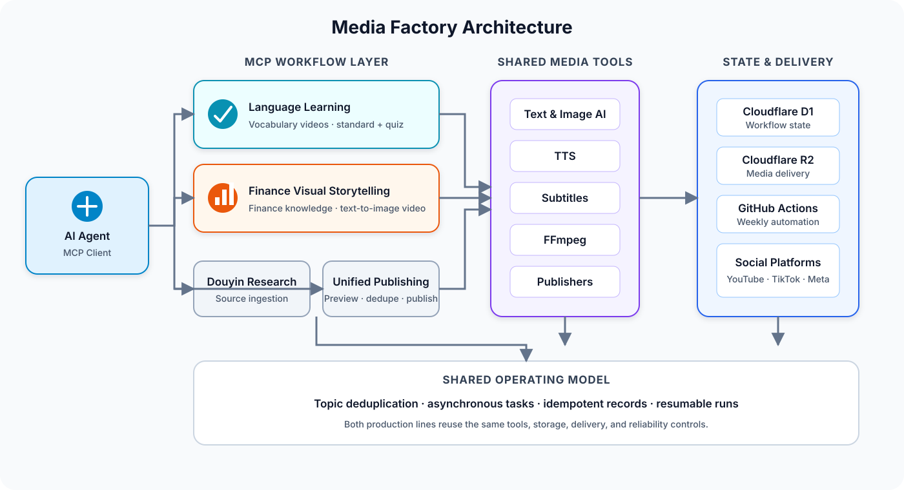

# Media Factory

[English](README.md) | [简体中文](README.zh-CN.md)

An agent-orchestrated production and publishing system for short-form video.

Media Factory turns source material into production-ready vertical videos through reusable media tools, Model Context Protocol (MCP) workflows, durable production records, and multi-platform publishing integrations.

It currently operates two production lines: language-learning videos and finance knowledge videos built through a text-to-image workflow. Douyin research ingestion and unified multi-platform publishing support both lines.

## Why This Project Exists

Producing one short video is straightforward. Operating a repeatable content pipeline is not.

A production system must coordinate source selection, topic deduplication, script and image generation, text-to-speech, subtitles, video rendering, artifact delivery, publication scheduling, and failure recovery—without producing duplicate topics or publishing the same video twice.

Media Factory treats these concerns as a stateful workflow rather than a collection of disconnected generation scripts.

## Key Capabilities

### Agent-Orchestrated Production

Each business workflow is exposed as an independent MCP server. An AI agent can inspect source material, prepare content, start long-running jobs, review generated assets, and continue the pipeline through structured tool calls.

Long-running operations use asynchronous start-and-poll tasks so MCP clients are not blocked by image generation or FFmpeg rendering.

### Reusable Media Tooling

The pipelines share Python packages for:

- Text, image, and speech generation
- Subtitle, cover, and shot composition
- FFmpeg-based video assembly
- Video downloading and transcription
- Cloud storage and durable data access
- Platform-specific publishing

MCP servers orchestrate these public tool APIs instead of embedding media-processing logic in the protocol layer.

### Durable and Idempotent Workflows

Cloudflare D1 stores operational state such as topic reservations, source usage, production outputs, vocabulary history, generated images, and publication records.

Production and publication writes are idempotent. A partially completed run can be inspected and resumed without blindly recreating assets or reposting successful platform deliveries.

### Multi-Platform Publishing

The unified publishing workflow supports YouTube, TikTok, Facebook, Instagram, Douyin, Kuaishou, Toutiao, and WeChat Channels.

Before publishing, the system previews selected outputs, resolves the account group, and checks existing publication records. Successful platform operations are recorded individually so partial failures can be retried safely.

### Scheduled Batch Production

GitHub Actions runs a weekly production workflow for the following Monday through Sunday. Each target date is processed independently and sequentially, so one failed product or date does not stop the remainder of the schedule.

Generated assets are delivered through Cloudflare R2, while Telegram notifications report production and publishing results.

## Architecture



The repository deliberately separates orchestration from implementation:

```text
core/
├── mcp/             # MCP workflow servers and background-task orchestration
└── tools/           # Reusable media, storage, data, and publishing packages

ops/
├── cloudflare/      # D1 data API and database migrations
├── github_actions/  # Scheduled production orchestration
└── youtube/         # YouTube OAuth utilities

integrations/
└── MatrixMedia/     # Local multi-platform publishing integration

dashboard/           # Publishing dashboard
config/              # Runtime configuration
data/                # Persistent local libraries
cache/               # Recoverable intermediate artifacts
output/              # Completed local productions
```

## Production Pipelines

### Finance Visual Storytelling

```text
Source selection
    → script adaptation
    → topic validation
    → metadata and title generation
    → TTS and storyboard
    → shot-image generation
    → cover and video assembly
    → production record
    → R2 delivery
```

This text-to-image production line turns finance knowledge into visual short-form stories. Source scripts are reserved before use and marked as consumed only after the draft is saved. Generated images are tracked independently so failed database writes can be retried without regenerating the underlying asset.

### Language Learning

```text
Topic selection
    → vocabulary generation
    → vocabulary-history validation
    → subject-sheet generation
    → visual review
    → fixed-card composition
    → bilingual TTS
    → standard and quiz videos
    → production record
    → publishing
```

Vocabulary is checked against recent history to reduce repetition. The same run generates both a standard learning video and a countdown-based quiz variant.

### Douyin Research

```text
Shared link
    → video download
    → audio transcription
    → category assignment
    → D1 ingestion
```

The research pipeline converts an individual Douyin share link into reusable source material for downstream content production.

## Technology Stack

- Python 3.10+
- Model Context Protocol with FastMCP
- FFmpeg and Pillow
- Qwen text, vision, and image models
- Groq Whisper transcription
- Cloudflare D1 and R2
- GitHub Actions
- YouTube Data API, Zernio, and MatrixMedia
- Docker

## Getting Started

### Prerequisites

- Python 3.10 or later
- FFmpeg available on `PATH`
- An MCP-compatible client
- Credentials for the external services used by the selected workflow

Not every integration is required. For example, local finance production does not require credentials for every publishing platform.

### 1. Clone the Repository

```bash
git clone git@github.com:xdh5/media-factory.git
cd media-factory
```

### 2. Configure the Environment

```bash
cp .env.example .env
```

Configure only the services required by the workflow you intend to run. Available settings are documented in `.env.example`. Never commit the populated `.env` file.

### 3. Install the Runtime

Install FFmpeg separately, then install the Python dependencies:

```bash
python -m pip install .
```

Alternatively, build the included Docker image:

```bash
docker build -t media-factory .
```

### 4. Configure the MCP Servers

Each workflow runs as a separate stdio MCP server:

| Server | Entry point | Responsibility |
| --- | --- | --- |
| Finance Visual Storytelling | `python -m core.mcp.finance` | Finance knowledge text-to-image video production |
| Language Learning | `python -m core.mcp.language_learning` | Vocabulary video production |
| Publishing | `python -m core.mcp.publishing` | Output discovery and multi-platform publishing |
| Douyin Research | `python -m core.mcp.douyin_research` | Link download, transcription, and ingestion |

Example MCP client configuration:

```json
{
  "mcpServers": {
    "media-factory-finance": {
      "command": "python",
      "args": ["-m", "core.mcp.finance"],
      "env": {
        "PYTHONPATH": "/absolute/path/to/media-factory",
        "PYTHONUTF8": "1",
        "DASHSCOPE_BUSINESS_LINE": "finance"
      }
    },
    "media-factory-language-learning": {
      "command": "python",
      "args": ["-m", "core.mcp.language_learning"],
      "env": {
        "PYTHONPATH": "/absolute/path/to/media-factory",
        "PYTHONUTF8": "1",
        "DASHSCOPE_BUSINESS_LINE": "language_learning"
      }
    },
    "media-factory-publishing": {
      "command": "python",
      "args": ["-m", "core.mcp.publishing"],
      "env": {
        "PYTHONPATH": "/absolute/path/to/media-factory",
        "PYTHONUTF8": "1"
      }
    }
  }
}
```

Replace the repository path and Python executable with absolute paths appropriate for your machine.

## Output Model

Local productions are stored by business line and planned publication date:

```text
output/{business_line}/run-YYYYMMDD/
```

The date represents the intended publication date in the Asia/Shanghai timezone. Exact scheduled publication times are stored separately as timezone-aware timestamps.

Intermediate files remain under `cache/` so interrupted workflows can be diagnosed or resumed. Cleanup is an explicit operation and is never performed automatically after publishing.

Production records preserve artifact provenance:

- `local_mcp` records reference a local file path.
- `github_workflow` records are committed only after successful R2 delivery.
- Uploading a local artifact to R2 supplements its existing record without changing its origin.

## Reliability Design

- Topic reservations prevent concurrent duplicate production.
- Publication records prevent duplicate platform uploads.
- Source-script reservations expire when a run is abandoned.
- Long-running jobs expose persistent task status.
- Platform successes are committed independently.
- Local and cloud-produced assets retain distinct provenance.
- Publishing and local-file cleanup are separate operations.
- Weekly jobs continue after an isolated date or product failure.

These safeguards allow the system to recover from partial failures without treating every retry as a completely new run.

## Workflow Automation

The repository provides GitHub Actions workflows for:

- Building the production runner image
- Producing the following week's language-learning and finance visual content
- Manually resuming missing language-learning publications
- Deploying the publishing dashboard

The weekly workflow runs every Saturday at 12:00 Asia/Shanghai and processes the next Monday-through-Sunday schedule.

## Internal Documentation

- [Finance MCP](core/mcp/finance/finance.md)
- [Language Learning MCP](core/mcp/language_learning/language_learning.md)
- [Publishing MCP](core/mcp/publishing/publishing.md)
- [Operations](ops/README.md)

## Current Scope

Media Factory is an operational content-production system, not a generic drag-and-drop video editor.

Its two production lines currently encode business rules for language learning and finance knowledge visual storytelling. The lower-level tools are reusable, while each new content vertical is expected to define its own prompts, validation rules, and MCP orchestration.

## License

No open-source license has been declared for this repository. Unless a license is added, the source code should be treated as proprietary.
